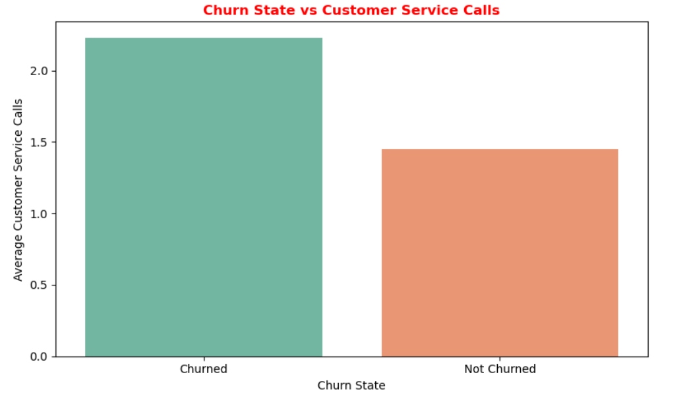

# SyriaTel Customer Churn: A Data-Driven Analysis for Strategic Intervention

## Project Overview

This project analyzes customer churn in the telecommunications sector, a critical challenge that directly impacts profitability due to the higher cost of acquiring new customers compared to retaining existing ones. The case study focuses on **SyriaTel**, a telecom provider experiencing ongoing customer losses, with the objective of identifying which customers are most likely to churn and the key factors driving this behavior.  

The primary goal is to **predict churn early**, allowing SyriaTel to implement targeted retention strategies such as personalized offers, improved customer support, and customized plan adjustments to reduce customer churn and enhance long-term profitability.  

---

## Business Objectives

1. **Predict Customer Churn** – Build machine learning models using account details, usage patterns, and service interactions.  
2. **Identify Key Churn Drivers** – Highlight factors like international plans, high usage, and frequent support calls.  
3. **Measure Model Effectiveness** – Ensure high predictive accuracy using metrics like **F1 score ≥ 89%** and **precision ≥ 97%**.  
4. **Recommend Retention Strategies** – Translate insights into actionable interventions to retain at risk customers.

## Data Source

- **Dataset**: [SyriaTel Customer Churn Dataset](https://www.kaggle.com/becksddf/churn-in-telecoms-dataset)
- **Records**: 3,333 records and 21 features
- **Key Info**: Binary Target Variable(Churn) and customer account details, usage behavior (calls, minutes, charges), and interactions with customer service.

## Data Cleaning & Preparation

- Dropped non-predictive columns such as `phone number` (unique per customer, no modeling value)  
- Standardized categorical fields (`intl_plan`, `vmail_plan`, `state`) for consistency  
- Verified dataset completeness: **No missing values and No duplicates found  
- Renamed columns for clarity and modeling i.e.`account length` → `acc_length`, `total day minutes` → `ttl_day_mins`)  
- Retained outliers, as removing them would discard important customer usage behavior of heavy callers or frequent customer care contacts. 
- Stored `area_code` as a string instead of numeric, since it acts as a categorical label, not a continuous value  
- Identified class imbalance in the target variable `churn` (14.5% churn vs. 85.5% retained), requiring special handling during modeling.  

---

## Feature Engineering

- Created aggregate usage features (total calls, minutes, and charges)  
- Derived ratios such as share of international usage, proportion of day calls  
These engineered features help capture customer behavior patterns and improve churn prediction accuracy.  

---

## Key Visualizations

### Objective 1: Churn Profiles
- Overall churn rate: **15%** of customers churned, indicating class imbalance (~85% did not churn).  
- Customers with **International Plans** exhibited higher churn rates (~42%), compared to ~11% for those without.   

### Objective 2: Contributing Factors
- **Customer service calls** and **high total charges** were strongly associated with churn.   
- **Voicemail plan adoption** is associated with lower churn variability and thus customers with voicemail plans tend to be more stable.   

### Objective 3: Geographic Factors
- Area code 415 has the highest number of customers and elevated churn, while 408 and 510 show lower churn despite similar customer volumes.  
- **High-churn states** include New Jersey, Texas, Maryland, and Minnesota, suggesting targeted regional interventions.  
- Churn is influenced more by **plan type and service experience** than geography alone.  

---

## Tools & Technologies

- **Python 3.11**
- **Pandas, NumPy** – Data processing
- **Seaborn, Matplotlib** – Visualization
- **Jupyter Notebook** – Interactive Analysis
- **Scikit-learn, Statsmodels** – Hypothesis Testing and Modeling  
- **Markdown, PDF, PowerPoint** – Reporting and Presentation

---

## Strategic Recommendations

### 1. Focus Retention on At-Risk Segments
-  Identify customers with **International Plans** and those making **frequent customer support calls**.  
-  Offer proactive outreach, loyalty rewards, or usage based incentives to these high risk groups.  

### 2. Improve Quality of Service and Billing
- Optimize customer service to reduce repeat or unresolved support calls.  
- Implement **flatrate billing** for heavy users, allowing them to enjoy more minutes and data after a certain threshold without incurring unexpectedly high charges.  

### 3. Leverage Plan Features to Reduce Churn
- Encourage adoption of **voicemail plans** for high_usage customers, as those without voicemail show higher churn and usage variability.  
- Offer **customized international or bundled plans** to customers with heavy international calling to reduce churn driven by high charges.  
- Educate customers on plan benefits to highlight convenience, predictability, and cost savings.  

### 4. Regional and State-Level Retention Strategies
- Target **high-churn states** such as New Jersey, Texas, Maryland, and Minnesota with retention campaigns.  
- Investigate and address service quality or infrastructure issues in **area code 415**, where churn is elevated despite high customer volume.  
- Deploy **localized promotions** and faster issue resolution to strengthen loyalty in at-risk regions.

---

## Conclusion

The analysis shows that churn is influenced by a combination of **plan type, usage behavior, and service interactions**. Customers with **International Plans**, high **total charges**, frequent **customer support calls**, and those without **voicemail plans** are at higher risk of churn. While area code 415 shows elevated churn, overall geography does not significantly predict churn. Targeting these high risk segments with **improved service, tailored plan options, and proactive retention strategies** offers the most effective way to reduce churn and increase customer loyalty.

---

## Contact

**Author**: Brian Kiprop Kibor  
**Email**: kipropbrian26@gmail.com  
**Location**: Oulu Finland  
